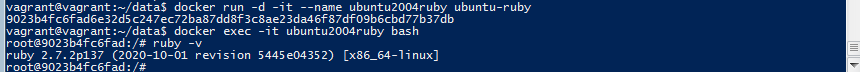

2.6 Working with Docker 
2.6.1 Create project directory and go into it:
```bash
$ mkdir data
$ cd data
```			
2.6.2 Install docker on the VM using official tutorial https://docs.docker.com/engine/install/ubuntu/


2.6.3 Run docker container with nginx:
```bash
$ docker run -it --rm -d -p 8080:80 --name web nginx
```		
2.6.4 Run docker container with MySQL:
```bash
$ docker run -d --rm --name mysql-web -v /data -e MYSQL_ROOT_PASSWORD=Pass1234 mysql:latest
```		
2.6.5 Working with MySQL:
```bash
$ docker exec -it mysql-web bash
$ mysql -u root -p 
$ use mysql
$ CREATE USER 'ZhukAV'@'%' identified by 'Pass12345'
$ CREATE DATABASE Itransition
```			

	
2.7 Working with Dockerfile
2.7.1 Create Dockerfile:
```bash
$ nano Dockerfile
```		
2.7.2 Fill Dockerfile instruction to install ruby:

	
#2.7.3 Run container from Dockerfile image:
```bash
$ docker build ~/data -t ubuntu-ruby
$ docker run -d -it --name ubuntu2004ruby ubuntu-ruby
$ docker exec -it ubuntu2004ruby bash
$ ruby -v 
```	


2.8 Working with Docker Compose
2.8.1 Install docker-compose using official tutorial https://docs.docker.com/compose/install/
2.8.2 Create docker-compose.yml file:	
	
```bash
$ docker-compose up -d	
```


	

