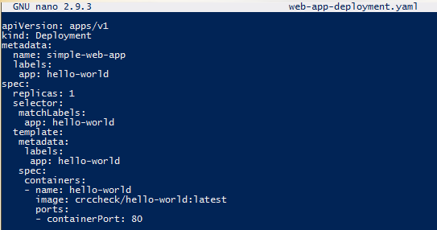
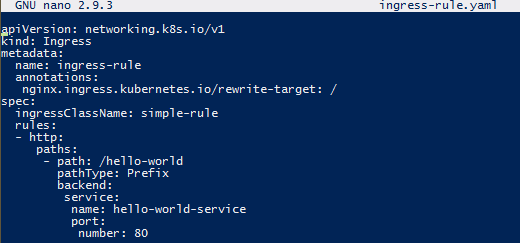
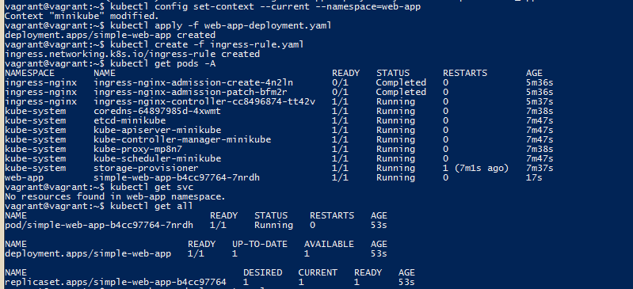

2.9 Working with Kubernetes
2.9.1 Install Minikube using official tutorial https://kubernetes.io/ru/docs/tasks/tools/install-minikube/
```bash
$ minikube start
```
2.9.2 Create namespace:
```bash
$ kubectl create namespace web-app
```
#2.9.3 Create deployments.yaml file:
```bash
$ nano web-app-deployment.yaml
```

	
#2.9.4 Install NGINX Ingress Controller:
```bash
$ minikude addons enable ingress
```
#2.9.5 Create ingress rule:
```bash
$ nano ingress-rule.yaml
```

```bash
$ kubectl config set-context --current --namespace=web-app
$ kubectl apply -f web-app-deployment.yaml
$ kubectl create -f ingress-rule.yaml
$ kubectl get pods -A
$ kubectl get svc
$ kubectl get all
```	

	